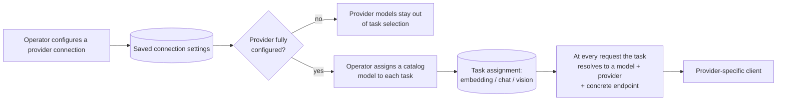

# Model management

How models and their providers (Ollama, DeepSeek, MiniMax) are structured and
managed. Written as a **methodology**: it describes the scheme in general terms,
so it stays useful even as catalog entries, settings layouts, or endpoint names
change.

## One model registry, three declared layers

Model handling is split so that each concern changes independently:

| Layer                 | Owns                                                               | Changes when                        |
| --------------------- | ------------------------------------------------------------------ | ----------------------------------- |
| **Provider registry** | Wire dialect, default endpoint, which fields a connection collects | A new vendor or wire format appears |
| **Model catalog**     | What a model can do and its call defaults                          | A vendor ships a new model          |
| **Task assignment**   | Which model answers which job (embedding / chat / vision)          | An operator re-points a role        |

> **Wire dialect** = the HTTP request/response shape a vendor's API expects
> (endpoint layout, JSON body schema, auth header). One dialect per provider.

Connection settings (credentials) sit between the catalog and the assignment:
they are operator-supplied values per provider, not per model.

## Provider registry

A **provider** declares the wire-level facts for one vendor endpoint:

- a **wire dialect** (`request shape`) the adapter speaks — one dialect per provider;
- a **default base URL** for that vendor;
- which **connection fields** an operator must fill (API key, base URL, port);
- optional fixed request headers.

Today's set:

| Provider                     | Wire dialect                           | Connection an operator supplies |
| ---------------------------- | -------------------------------------- | ------------------------------- |
| Ollama (local)               | Native embeddings API                  | host, port (no API key)         |
| MiniMax (standard)           | Anthropic-compatible chat / vision API | API key                         |
| MiniMax (token-plan billing) | Anthropic-compatible chat / vision API | API key                         |
| DeepSeek                     | Anthropic-compatible chat / vision API | API key                         |

Two practical consequences of the model:

- **Capability is not bound to a vendor.** Chat and vision happen to run over the
  Anthropic-compatible dialect (MiniMax and DeepSeek), while embeddings run over
  Ollama's native dialect. The system also _recognises_ an OpenAI-compatible
  embeddings dialect, but no provider currently maps to it — wiring one up is
  declarative.
- **A distinct endpoint means a distinct provider.** Because a connection is
  keyed by provider, two deployments of the same vendor that need different keys
  or URLs (e.g. MiniMax standard vs. token-plan) are modelled as two providers,
  not as one provider with two connection rows.

## Model catalog

A **model** belongs to exactly one provider and declares:

- a globally unique **id** used in persisted settings;
- its **provider**;
- the **capabilities** it offers — `embedding`, `llm` (chat), `vision`;
- **call defaults** — context window, max output tokens, embedding dimensions,
  temperature.

The supported set is declared once and read-only at runtime; operators cannot
invent models or providers, only configure the declared ones and assign them.

Today's catalog, grouped by capability:

| Model                     | Provider | embedding  | chat (`llm`) | vision |
| ------------------------- | -------- | :--------: | :----------: | :----: |
| `nomic-embed-text:latest` | Ollama   | yes (768d) |              |        |
| MiniMax M3                | MiniMax  |            |     yes      |  yes   |
| MiniMax M3 (token plan)   | MiniMax  |            |     yes      |  yes   |
| DeepSeek V4 Flash         | DeepSeek |            |     yes      |        |
| DeepSeek V4 Pro           | DeepSeek |            |     yes      |        |
| DeepSeek V4 Flash Vision  | DeepSeek |            |     yes      |  yes   |

## Connection settings

Connections are stored **per provider**, never per model: every model under one
provider shares the same API key, base URL, and port. Each field may be empty
(`null`); a connection is only meaningful once every field the provider declares
is filled — that state is called **fully configured**.

Two overrides refine where the provider is reached:

- a saved **base URL** replaces the provider's default entirely (useful for an
  on-premises instance);
- a saved **port** replaces the port of the resolved URL.

Fully empty connections are dropped on save rather than kept around.

## Task assignment

The assignment is a small map with one **slot per task** — `embedding`, `llm`,
`vision` — each holding a catalog model id or nothing. It is the only
operator-facing "which model is used for X" decision.

Selection rules keep the assignment consistent with reality:

- a model can be picked only if its provider's connection is fully configured;
- a model only appears in the dropdown for a task it declares a capability for;
- if a provider stops being fully configured, any task pointing at one of its
  models is cleared automatically instead of lingering on a broken target;
- saving is a merge: an operator may update connections, task pointers, or both,
  without touching the other map.

## Request-time resolution

Every call (embedding, chat, vision) follows the same read path, from the task
the caller needs, not from a hardcoded vendor:

1. read the current settings;
2. look up the model id assigned to that task — fail clearly if none is assigned;
3. confirm the model declares that task's capability;
4. resolve the model's provider and that provider's saved connection;
5. verify the connection is fully configured;
6. combine the catalog default URL with the saved overrides into the concrete
   endpoint and key;
7. hand the resolved model + endpoint to the adapter for the provider's dialect.

The same checks power the **per-model test**: an operator can call a specific
model's endpoint directly (through its provider's saved connection) without
first assigning it to any task — which is how you validate a freshly configured
provider before committing to use it.

## Changing models over time

Switching the **chat or vision** model takes effect on the next request; nothing
is stored against past calls.

Switching the **embedding** model is different, because vectors are written
artifacts. Every stored vector records which model produced it; a row is
"current" only when its recorded model matches the model now assigned to the
embedding task. After an embedding-model change the old vectors are treated as
stale and a re-embed pass refreshes them. The endpoint or key that wrote a vector
is never snapshotted onto the artifact — only the model identity matters for
staleness.

## Adding a provider or model

High-level recipe, matching the three layers:

1. **Provider**: add one only when the wire dialect is new or the deployment
   needs its own credentials; otherwise reuse an existing provider.
2. **Model**: declare the entry under its provider with capabilities and
   defaults.
3. **Connection + assignment**: an operator fills the provider's connection
   fields, then assigns the new model to the tasks it should serve.

Callers depend on the capability, not on the provider, so no caller changes when
a model or provider is added, swapped, or removed.

## Consistency rules (recap)

- Connection settings are **keyed by provider**; task pointers are **keyed by
  capability**; a model id always names a catalog entry.
- A task pointer may only reference a model whose provider is fully configured.
- Resolution reads current settings at call time; never cache a resolved
  endpoint across configuration changes.
- Embedding staleness compares the stored producer model to the **current**
  embedding assignment — not to a hardcoded string.
- A per-model connectivity test must not require a task assignment to exist.
