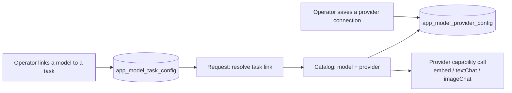

# Model management

How models and their providers (Ollama, DeepSeek, MiniMax) are structured and
managed. Written as a **methodology**: it describes the scheme in general terms,
so it stays useful even as catalog entries or endpoint names change.

## Two modules: providers + task links

Model handling is split into two self-contained modules so each concern changes
independently:

| Module             | Owns                                                                       | Changes when                |
| ------------------ | -------------------------------------------------------------------------- | --------------------------- |
| **model-providers** | Providers, their models, connection payloads, capability calls, diagnostics | A vendor or model changes   |
| **task-model-map**  | Which catalog model serves which app task                                   | An operator re-points a job |

`model-providers` is a **core** (catalog, provider classes, connection DAL) plus
a thin HTTP layer. `task-model-map` stores only links and stays deliberately
simple: "task X currently uses model Y".

## Provider registry (model-providers core)

A **provider** is a self-contained, stateless class. It owns:

- its **models** (nested underneath it);
- its **connection type** and `validateConnection(raw)` — the only shape its
  saved payload may take;
- its **capability calls** (`embed`, `textChat`, `imageChat`), implemented over
  its own wire protocol (hardcoded in the provider; a comment documents which);
- fixed data such as a **base URL** and **headers** where the protocol needs
  them.

Each provider is exported as a singleton and aggregated by `core/catalog.ts`
(`PROVIDERS`, `getProviderById`, `allModels`, `getModel`, `getModelByIdentifier`,
`getModelsByCapability`). Adding a provider means adding one self-contained
module; the catalog just lists it.

Today's set:

| Provider                     | Protocol (hardcoded)          | Connection an operator supplies |
| ---------------------------- | ----------------------------- | ------------------------------- |
| Ollama (local)               | Ollama `/api/embed`           | base URL, port                  |
| MiniMax (standard)           | Anthropic Messages            | API key                         |
| MiniMax (token-plan billing) | Anthropic Messages            | API key                         |
| DeepSeek                     | Anthropic Messages            | API key                         |

Two practical consequences:

- **Capability is not bound to a provider.** Embedding runs over Ollama's API;
  text and image chat run over the Anthropic Messages API (MiniMax, DeepSeek).
- **A distinct endpoint means a distinct provider.** Two deployments of the same
  vendor that need different keys or URLs (MiniMax standard vs. token-plan) are
  two providers, not one provider with two connection rows.

## Model catalog

A **model** belongs to exactly one provider and declares:

- a globally unique **`identifier`** — `{providerId}::{modelId}`, all lowercase;
- a **`modelId`** — the model's id within its provider, case-sensitive (it is the
  value sent on the wire);
- the **capabilities** it offers — `embedding`, `text`, `vision`;
- **call defaults** — context window, max output tokens, embedding dimensions,
  temperature.

The supported set is declared once and read-only at runtime; operators cannot
invent models or providers, only configure the declared ones and link them.

Today's catalog:

| Model                     | Provider | embedding  | text | vision |
| ------------------------- | -------- | :--------: | :--: | :----: |
| `nomic-embed-text:latest` | Ollama   | yes (768d) |      |        |
| `embeddinggemma:latest`   | Ollama   | yes (768d) |      |        |
| MiniMax-M3                | MiniMax  |            | yes  |  yes   |
| MiniMax-M3 (token plan)   | MiniMax  |            | yes  |  yes   |
| DeepSeek Flash            | DeepSeek |            | yes  |  yes   |
| DeepSeek V4 Pro           | DeepSeek |            | yes  |        |

## Connections

Connections are stored **per provider**, never per model: every model under one
provider shares the same payload. Each provider declares its own payload shape
(e.g. Ollama `{ baseUrl, port }`, Anthropic-compatible `{ apiKey }`), and
`validateConnection` rejects anything else. Values are used as entered — there is
no defaulting or fallback in code. A connection is **fully configured** once
every field the provider requires is present.

Writes go through `model-providers/core/dal.ts`, which owns the
`app_model_provider_config` singleton row and serializes read→recompose→write
under an in-process lock so concurrent admin writes cannot lose updates.

## Task links (task-model-map)

The link map has one **slot per app task**:

- `embedding`
- `text-synthesis`
- `md-image-captioning`

Each slot holds a catalog model `identifier` or nothing. A task declares the
capabilities it requires (e.g. `md-image-captioning` needs `text` + `vision`), and
a link is accepted only when the model resolves in the catalog and covers those
capabilities. Unknown tasks are rejected, not silently dropped.

`task-model-map` stores only the link. It does not validate provider connections;
resolution fails at call time if the linked provider is not configured.

## Request-time resolution

Every call follows the same read path, from the task the caller needs:

1. `resolveTaskModelLink(taskId)` reads the link and looks the model up in the
   catalog (provider + model), or returns `null` when the task is unassigned;
2. the caller invokes the provider's capability method — `embed`,
   `textChat`, or `imageChat` — passing the model's `modelId`;
3. the provider loads its own saved connection and calls its hardcoded upstream
   protocol.

For embeddings, the **staleness key** written next to each vector is the model
`identifier`. A stored vector is "current" only when its identifier matches the
one now linked to the `embedding` task; after an embedding-model change the old
vectors are stale and a re-embed pass refreshes them.

The same catalog powers **per-model diagnostics** on the providers page: an
operator can test a specific model over its provider's saved connection without
linking it to any task.

## HTTP surface (admin)

`server-setting/model-providers`:

- `GET  /providers` — catalog (providers with nested models)
- `GET  /providers/:providerId/connection` — read a provider's connection
- `PUT  /providers/:providerId/connection` — validate + save it
- `DELETE /providers/:providerId/connection` — clear it
- `POST /providers/:providerId/test/embed|chat|image` — per-model diagnostics

`server-setting/task-model-map`:

- `GET /` — the task → model `identifier` links
- `PUT /` — set/clear links (partial)

## Adding a provider or model

1. **Provider**: add one only when the protocol is new or the deployment needs its
   own credentials; otherwise reuse an existing provider.
2. **Model**: declare the entry under its provider with `identifier`, `modelId`,
   capabilities, and defaults.
3. **Connection + link**: an operator saves the provider's connection, then links
   the model to the tasks it should serve.

Callers depend on the capability, not on the provider, so no caller changes when
a model or provider is added, swapped, or removed.

## Consistency rules (recap)

- Connections are **keyed by provider**; links are **keyed by task**; a link value
  is a catalog model `identifier`.
- A link may only reference a model that resolves in the catalog and covers the
  task's required capabilities.
- Resolution reads current links and connections at call time; never cache a
  resolved endpoint across configuration changes.
- Embedding staleness compares the stored producer `identifier` to the **current**
  embedding link.
- A per-model connectivity test must not require a task link to exist.
