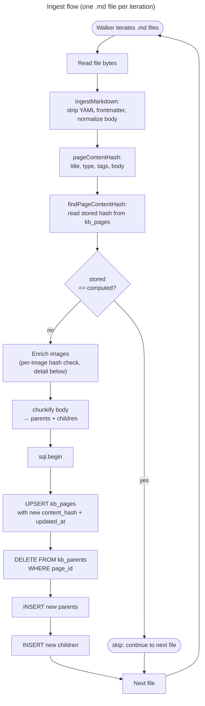
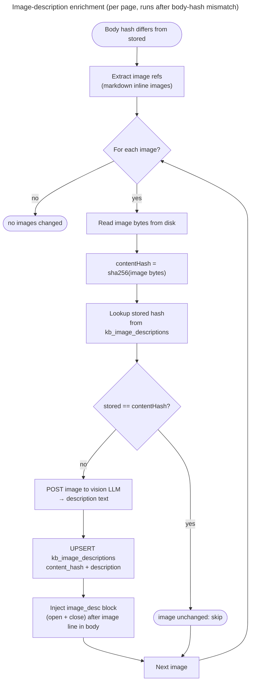

# Ingest (file → page `body`)

Which files exist is [01-corpus.md](./01-corpus.md). Ingest turns one markdown **file** into page columns. Chunking starts after that: [03-chunkify.md](./03-chunkify.md). Embed: [04-embed.md](./04-embed.md). Query: [05-query.md](./05-query.md). Synthesis: [06-synthesis.md](./06-synthesis.md). Schema: [appendix-a-data-model.md](./appendix-a-data-model.md).

```text
file.md → strip leading YAML frontmatter → normalize → kb_pages.body → chunkify(body)
```

`title` / `tags` / `type` come from frontmatter (columns). **`body`** is the remaining markdown after ingest. `chunkify` never strips frontmatter.

## Flow

One `.md` file per walker iteration. The hash gate is the **whole-page** skip — there is no per-section or per-parent hash today. Image-description enrichment is a planned sub-step that runs between the body-hash mismatch and `chunkify`; its detail is in the next section.



After the loop, **prune rows that disappeared from the walker** (e.g. files deleted between syncs):

```text
DELETE FROM kb_pages WHERE source_path IS NOT NULL
  AND NOT (source_path = ANY(<walker source_paths>));
```

## Image description enrichment (planned)

This is the detail of the **`Enrich`** node in the main flowchart above — runs once per page where the body hash differs from stored (right before `chunkify`). The enricher walks the markdown body once and makes sure every image link has an LLM-generated description sitting in the body. Each image is hashed on its bytes; descriptions are stored in a side table so re-ingesting a page whose images haven't changed is a no-op for the per-image LLM call.

The body that comes out is the same one `chunkify` then sees — descriptions are part of `kb_pages.body` and the new hash.



New table tracks (pageId, imagePath) → (bytes hash, description):

```text
kb_image_descriptions (
  page_id      text,         -- e.g. "src/app/en-US/faq/latest/chitu-manager-faq"
  image_path   text,         -- the path used inside the markdown body
  content_hash text,         -- sha256 hex of the image bytes
  description  text,         -- LLM-generated text
  created_at   timestamptz default now(),
  updated_at   timestamptz,
  primary key (page_id, image_path)
);
```

**Idempotency:** if a `<!-- image_desc --> ... <!-- /image_desc -->` block already sits right after the image, the injector replaces it in place instead of appending a duplicate. Re-running the enricher on a body that already has descriptions is a no-op.

**Hash unit:** image bytes (the file on disk), not the markdown line that references it. So changing the surrounding markdown text without swapping the image still re-describes that image (good — the description text gets the new context).

## Frontmatter

Strip only if the file **begins** with `---\n` … closing `---\n` (optional newline after the closer). A later `---` in the body is a thematic break or content. Unclosed opening `---` is not frontmatter.

Recognized keys: `title`, `tags` (inline `[a, b]` or a YAML list), `type`. Trim string values at ingest.

## Body

Canonical `kb_pages.body`:

- `\r\n` / `\r` → `\n` (do this before detecting `---\n` so CRLF files still match)
- strip trailing spaces on each line
- ensure a single final `\n`
- no Unicode NFC (not required)

The same map is **idempotent**. `chunkify` may re-apply it; it does not strip YAML. CRLF round-trip is out of scope.

Hashes, offsets, and parent/child slices use this string — not original file bytes.

## Incremental updates (page hash)

Skip gate is the **page**, not each child. Hash a stable encoding of the stored ingest-normalized fields, for example:

```ts
sha256(
  JSON.stringify({ title, type: type ?? null, tags: [...tags].sort(), body }),
);
```

Do not concatenate raw strings (`title + type + tags + body`) — `ab`+`c` and `a`+`bc` collide.

| Situation                                                | Action                                                     |
| -------------------------------------------------------- | ---------------------------------------------------------- |
| Hash match                                               | Skip                                                       |
| Hash differs                                             | Replace that page’s parent/child tree, then embed children |
| Same markdown, new embedding model (`kb_embed_settings`) | Re-embed stale children ([04-embed.md](./04-embed.md))     |

Shared path: hash check → optional replace → `chunkify` → embed → update `content_hash` / `embedding_model`.
