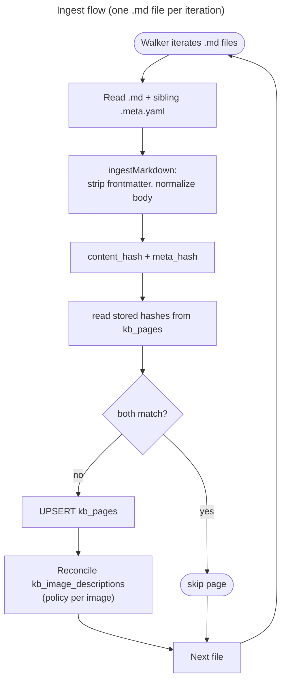

# Ingest (files → pages + image policy)

Ingest discovers the corpus files and turns each into a `kb_pages` row plus that page's image policy. Which files exist (docs root, include/exclude, `path → source_path` / `id`) is the [corpus layout contract](./01-corpus.md).

`title` / `tags` come from frontmatter. **`body`** is the remaining markdown; `chunkify` never strips frontmatter. `body` keeps only the image syntax (``); the caption is stored in `kb_image_descriptions`, not in the body ([03.2-image-descriptions.md](./03.2-image-descriptions.md)).

## Files

Ingest owns discovery: it runs the walker over the docs root and gets the included `*.md` files, one per page. The walk rules are the [corpus layout contract](./01-corpus.md).

After processing the files, ingest deletes any `kb_pages` row whose `source_path` is set but not among the files the walker returned (the file was deleted upstream):

```text
DELETE FROM kb_pages WHERE source_path IS NOT NULL
  AND NOT (source_path = ANY(<walker source_paths>));
```

## Flow

One `.md` file per iteration. The skip gate is the **page** (`content_hash` + `meta_hash`); there is no per-section hash. Ingest does no provider work and does not chunk or embed.



## Image policy reconciliation

Runs once per page whose hashes differ. For each image the body references, ingest records what to do with it in `kb_image_descriptions`:

- **Identity:** `(page_id, image_path)`.
- **Policy:** from the sibling `*.meta.yaml` — `ignore`, `manual`, or `vision-captioning`; images not listed default to `vision-captioning`.
- **`image_content_hash`:** sha256 of the image bytes, so a changed image is detectable.
- **`manual` description:** taken from the sidecar when the policy is `manual`.

Rows for images the page no longer references are deleted. This step is **policy only** — it never calls a model. The sidecar format, the caption pass, and the description vectors are [03.2-image-descriptions.md](./03.2-image-descriptions.md).

## Frontmatter

Strip only if the file **begins** with `---\n` … closing `---\n` (optional newline after the closer). A later `---` in the body is a thematic break or content. Unclosed opening `---` is not frontmatter.

Recognized keys: `title`, `tags` (inline `[a, b]` or a YAML list). Trim string values at ingest.

## Body

Canonical `kb_pages.body`:

- `\r\n` / `\r` → `\n` (do this before detecting `---\n` so CRLF files still match)
- strip trailing spaces on each line
- ensure a single final `\n`
- no Unicode NFC (not required)

The same map is **idempotent**. `chunkify` may re-apply it; it does not strip YAML. CRLF round-trip is out of scope.

Hashes, offsets, and parent/child slices use this string — not original file bytes.

## Incremental updates (page and meta hashes)

Two hashes decide whether ingest reprocesses a page:

| Hash           | Covers                                           |
| -------------- | ------------------------------------------------ |
| `content_hash` | `title` + `tags` + `body`                        |
| `meta_hash`    | the bytes of the sibling `*.meta.yaml` (or null) |

Skip the page only when **both** match the stored values. The content encoding is stable:

```ts
sha256(JSON.stringify({ title, tags: [...tags].sort(), body }));
```

| Situation                | Action                                                                                                         |
| ------------------------ | -------------------------------------------------------------------------------------------------------------- |
| Both match               | Skip the page                                                                                                  |
| Either differs           | Upsert `kb_pages`, then reconcile `kb_image_descriptions`                                                      |
| `content_hash` differs   | The page's chunk tree is stale — chunkify rebuilds it ([03.1-chunkify.md](./03.1-chunkify.md#chunk-freshness)) |
| `meta_hash` differs only | Body and chunk tree stay; only the image rows are reconciled                                                   |
