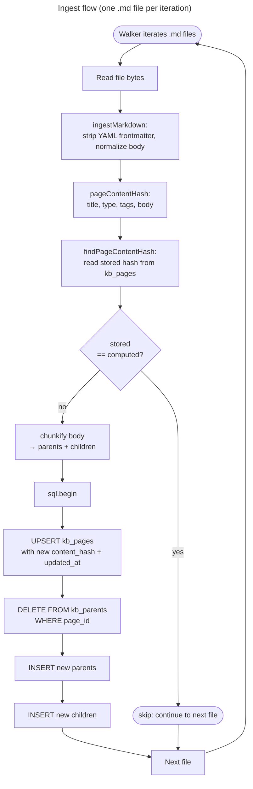

# Ingest (file → page `body`)

Which files exist is [01-corpus.md](./01-corpus.md). Ingest turns one markdown **file** into page columns. Chunking starts after that: [03-chunkify.md](./03-chunkify.md). Embed: [04-embed.md](./04-embed.md). Query: [05-query.md](./05-query.md). Synthesis: [06-synthesis.md](./06-synthesis.md). Schema: [appendix-a-data-model.md](./appendix-a-data-model.md).

```text
file.md → strip leading YAML frontmatter → normalize → kb_pages.body → chunkify(body)
```

`title` / `tags` / `type` come from frontmatter (columns). **`body`** is the remaining markdown after ingest. `chunkify` never strips frontmatter.

## Flow

One `.md` file per walker iteration. The hash gate is the **whole-page** skip — there is no per-section or per-parent hash today.



After the loop, **prune rows that disappeared from the walker** (e.g. files deleted between syncs):

```text
DELETE FROM kb_pages WHERE source_path IS NOT NULL
  AND NOT (source_path = ANY(<walker source_paths>));
```

## Frontmatter

Strip only if the file **begins** with `---\n` … closing `---\n` (optional newline after the closer). A later `---` in the body is a thematic break or content. Unclosed opening `---` is not frontmatter.

Recognized keys: `title`, `tags` (inline `[a, b]` or a YAML list), `type`. Trim string values at ingest.

## Body

Canonical `kb_pages.body`:

- `\r\n` / `\r` → `\n` (do this before detecting `---\n` so CRLF files still match)
- strip trailing spaces on each line
- ensure a single final `\n`
- no Unicode NFC (not required)

The same map is **idempotent**. `chunkify` may re-apply it; it does not strip YAML. CRLF round-trip is out of scope.

Hashes, offsets, and parent/child slices use this string — not original file bytes.

## Incremental updates (page hash)

Skip gate is the **page**, not each child. Hash a stable encoding of the stored ingest-normalized fields, for example:

```ts
sha256(
  JSON.stringify({ title, type: type ?? null, tags: [...tags].sort(), body }),
);
```

Do not concatenate raw strings (`title + type + tags + body`) — `ab`+`c` and `a`+`bc` collide.

| Situation                                                | Action                                                     |
| -------------------------------------------------------- | ---------------------------------------------------------- |
| Hash match                                               | Skip                                                       |
| Hash differs                                             | Replace that page’s parent/child tree, then embed children |
| Same markdown, new embedding model (`kb_embed_settings`) | Re-embed stale children ([04-embed.md](./04-embed.md))     |

Shared path: hash check → optional replace → `chunkify` → embed → update `content_hash` / `embedding_model`.
