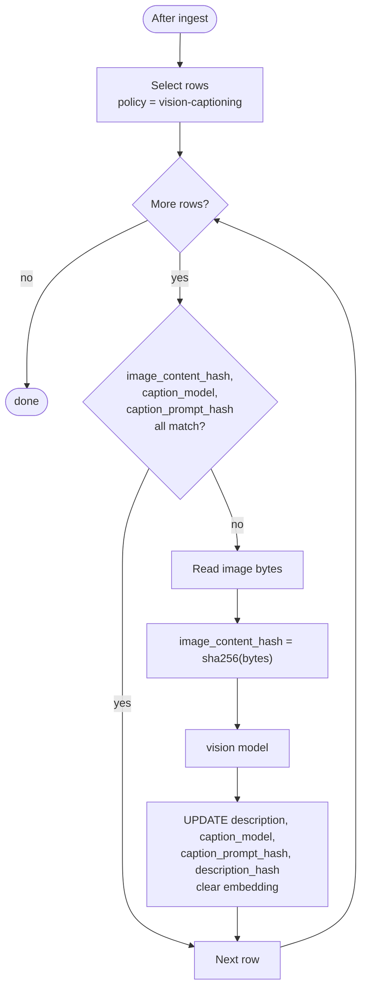

# Image descriptions (sidecar → captions → vectors)

Images referenced by a page are described **outside** `kb_pages.body`. The markdown file stays exactly as authored; a sibling `*.meta.yaml` says what to do with each image; captions live in `kb_image_descriptions`. This is what keeps ingest idempotent when a caption model changes.

Ingest records the policy ([02-ingest.md](./02-ingest.md#image-policy-reconciliation)). This doc is the **image contract**: sidecar format, the caption pass, description vectors, and how descriptions are used at retrieval/synthesis time.

## Sidecar format

For every ingested `<page>.md`, the walker looks for a sibling `<page>.meta.yaml` in the same directory ([01-corpus.md](./01-corpus.md#include-and-exclude)). It is optional; when absent, every image uses the default policy. It is **not** a page and never gets a `source_path`.

```yaml
# <page>.meta.yaml
assets/en-US/chapter-1/image-001.png:
  policy: vision-captioning
assets/en-US/chapter-1/image-002.png:
  policy: manual
  description: "The relay sits between the two quays."
assets/en-US/chapter-1/logo.png:
  policy: ignore
```

| Key                  | Value                                                                                       |
| -------------------- | ------------------------------------------------------------------------------------------- |
| canonical image path | see [Canonical image path](#canonical-image-path); **quote it** (`"…"`)                     |
| `policy`             | `ignore` \| `manual` \| `vision-captioning` (required)                                      |
| `description`        | required when `policy: manual`; the stored caption (a YAML block scalar for multiple lines) |
| unknown keys         | rejected                                                                                    |

Rules:

- **Default policy for an unlisted image is `vision-captioning`.** List an image with `policy: ignore` to exclude it.
- A sidecar entry that does not match any image referenced by the page is **ignored** (with a sync warning), not an error that fails the page.
- `policy: manual` without a `description` is an error for that page.
- The sidecar is read as UTF-8 and is part of the page's `meta_hash` ([02-ingest.md](./02-ingest.md#incremental-updates-page-and-meta-hashes)).

`vision-captioning` is the sidecar policy name; it selects the configured caption model.

## Canonical image path

`image_path` is the image reference resolved to a **docs-root-relative POSIX path**, and it is the same string in the sidecar key and in the stored row.

Given the markdown `source_path` (`<dir>/<page>.md`) and an image reference `ref` written in the body:

```text
image_path = normalize(posix(<dir>) + "/" + ref)   relative to the docs root
```

- `./a.png` and `a.png` in the same directory → one key (`<dir>/a.png`).
- `../assets/a.png` → resolved up one directory.
- Absolute paths and URL-scheme references (`https://…`) are **out of contract** for the sidecar; a page that uses them cannot be described (recorded as `ignore`, with a sync warning).
- The same rule is applied at synthesis time when matching a body reference back to a row ([05-synthesis.md](./05-synthesis.md#image-replacement)), so write and read agree byte-for-byte.

## Identity

One row per `(page_id, image_path)` — the same image referenced by two pages produces two rows (the default caption prompt uses surrounding page context, so captions are page-local). A page delete cascades to its rows.

| Column                | Meaning                                                                                         |
| --------------------- | ----------------------------------------------------------------------------------------------- |
| `page_id`             | `kb_pages.id` (FK, cascade)                                                                     |
| `image_path`          | canonical image path (see above)                                                                |
| `image_content_hash`  | sha256 hex of the image bytes                                                                   |
| `policy`              | `ignore` \| `manual` \| `vision-captioning`                                                     |
| `description`         | the caption text; `null` for `ignore` and for `vision-captioning` before the caption pass       |
| `caption_model`       | `{providerId}::{modelId}` that produced a `vision-captioning` description (`null` for `manual`) |
| `caption_prompt_hash` | sha256 of the hardcoded caption prompt (`null` for `manual`)                                    |
| `description_hash`    | sha256 hex of `description`; the embed-freshness key                                            |
| `embedding`           | pgvector of `description`; `null` until embedded                                                |
| `embedding_model`     | `{providerId}::{modelId}` that produced `embedding`                                             |
| `embedded_at`         | when `embedding` was last written                                                               |

`image_content_hash` is tracked even for `manual` / `ignore` rows so a change in image bytes is visible.

## Caption pass

Runs after ingest, before embedding. It is the **only** place that calls the vision model.



- **Skip** when `image_content_hash`, `caption_model`, and `caption_prompt_hash` all match the stored row and a description exists.
- **Re-caption** otherwise: read the image, compute the hash, call the vision model, normalize the reply to a single line, and update the row; clear `embedding` so the description is re-embedded.
- **`ignore` / `manual` rows are never touched here.** `manual` descriptions are written by ingest from the sidecar; if a manual description text changes, `meta_hash` changes and ingest updates it ([02-ingest.md](./02-ingest.md#image-policy-reconciliation)).
- **Failure policy.** A failed vision call leaves the previous `description` (or `null`) and logs; the next sync retries because the freshness key still differs. Pass `failFast` only for admin diagnostics.
- `caption_prompt_hash` is `sha256` of the hardcoded caption prompt. Editing the prompt changes the hash, so captions regenerate.

## Description embedding

The description is embedded with the shared embed utility using the **`embedding`** task model. Embed a description when:

```sql
policy IN ('manual', 'vision-captioning')
AND description IS NOT NULL
AND (embedding IS NULL OR embedding_model IS DISTINCT FROM $current_model)
```

`manual` descriptions are embedded too, so they are searchable. The freshness keys are `description_hash` (did the text change) and `embedding_model` (did the vector model change).

## Vector search

`queryImageDescriptions(query)` embeds the question with the current `embedding` task model and scans descriptions:

```sql
SELECT
  d.page_id,
  d.image_path,
  d.description,
  1 - (d.embedding <=> $1::vector) AS score
FROM kb_image_descriptions d
WHERE d.embedding IS NOT NULL
  AND d.embedding_model IS NOT DISTINCT FROM $current_model
  AND d.policy <> 'ignore'
ORDER BY d.embedding <=> $1::vector
LIMIT $2;
```

This is a **second vector search**, over `kb_image_descriptions.embedding`, independent of the child search over `kb_children.embedding` ([04-retrieval.md](./04-retrieval.md#image-description-channel)). Its hits are capped and merged into the synthesis context, labelled with the page title.
