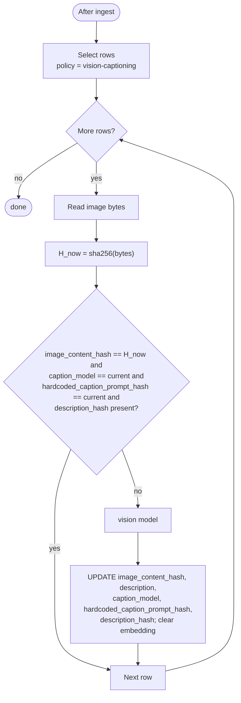

# Image descriptions (`*.meta.yaml` to captions to vectors)

Images referenced by a page are described **outside** `kb_pages.body`. The body keeps the image reference (``) and no caption text is injected into it (ingest's normal [body processing](./02-ingest.md#body) still applies). A sibling `*.meta.yaml` says what to do with each image; captions live in `kb_image_descriptions`. This is what keeps ingest idempotent when a caption model changes.

Ingest records the policy during reconciliation ([02-ingest.md](./02-ingest.md#image-policy-reconciliation)). This doc is the **image contract**: `*.meta.yaml` format, the caption pass, and description vectors.

## `*.meta.yaml` format

For every ingested `<page>.md`, the walker looks for a sibling `<page>.meta.yaml` in the same directory ([01-corpus.md](./01-corpus.md#include-and-exclude)). It is optional; when absent, every image uses the default policy. It is **not** a page and never gets a `source_path`.

```yaml
# <page>.meta.yaml
assets/en-US/chapter-1/image-001.png:
  policy: vision-captioning
assets/en-US/chapter-1/image-002.png:
  policy: manual
  description: "The relay sits between the two quays."
assets/en-US/chapter-1/logo.png:
  policy: ignore
```

| Key                  | Value                                                                                       |
| -------------------- | ------------------------------------------------------------------------------------------- |
| canonical image path | see [Canonical image path](#canonical-image-path); **quote it** (`"…"`)                     |
| `policy`             | `ignore` \| `manual` \| `vision-captioning` (required)                                      |
| `description`        | required when `policy: manual`; the stored caption (a YAML block scalar for multiple lines) |
| unknown keys         | rejected                                                                                    |

Rules:

- **Default policy for an unlisted image is `vision-captioning`.** List an image with `policy: ignore` to exclude it.
- A `*.meta.yaml` entry that does not match any image referenced by the page is **ignored** (with an ingest warning), not an error that fails the page.
- `policy: manual` without a `description` is an error for that page.
- The `*.meta.yaml` file is read as UTF-8 and is part of the page's `meta_hash` ([02-ingest.md](./02-ingest.md#incremental-updates-hash-gate)).

`vision-captioning` is the `*.meta.yaml` policy name; it selects the configured caption model.

## Canonical image path

`image_path` is the image reference resolved to a **docs-root-relative POSIX path**, and it is the same string in the `*.meta.yaml` key and in the stored row.

Given the markdown `source_path` (`<dir>/<page>.md`) and an image reference `ref` written in the body:

```text
image_path = normalize(posix(<dir>) + "/" + ref)   relative to the docs root
```

- `./a.png` and `a.png` in the same directory share one key (`<dir>/a.png`).
- `../assets/a.png` resolves up one directory.
- Absolute paths and URL-scheme references (`https://…`) are **out of contract** for the `*.meta.yaml`; a page that uses them cannot be described (recorded as `ignore`, with an ingest warning).
- The same canonical form is the `*.meta.yaml` key and the stored `image_path`, so the two agree byte-for-byte.

## Identity

One row per `(knowledge_base_id, page_id, image_path)` — the same image referenced by two pages produces two rows (the default caption prompt uses surrounding page context, so captions are page-local). A page delete cascades to its rows.

| Column                          | Meaning                                                                                                                                 |
| ------------------------------- | --------------------------------------------------------------------------------------------------------------------------------------- |
| `page_id`                       | `(knowledge_base_id, page_id)` FK to `kb_pages` (cascade)                                                                               |
| `image_path`                    | canonical image path (see above)                                                                                                        |
| `image_content_hash`            | sha256 of the image bytes the caption was built from; written by the caption pass; `null` before captioning and for `ignore` / `manual` |
| `policy`                        | `ignore` \| `manual` \| `vision-captioning`                                                                                             |
| `description`                   | the caption text; `null` for `ignore` and for `vision-captioning` before the caption pass                                               |
| `caption_model`                 | `{providerId}::{modelId}` that produced a `vision-captioning` description (`null` for `manual`)                                         |
| `hardcoded_caption_prompt_hash` | sha256 of the hardcoded caption prompt (`null` for `manual`)                                                                            |
| `description_hash`              | sha256 hex of `description`; the embed-freshness key                                                                                    |
| `embedding`                     | pgvector of `description`; `null` until embedded                                                                                        |
| `embedding_model`               | `{providerId}::{modelId}` that produced `embedding`                                                                                     |
| `embedded_at`                   | when `embedding` was last written                                                                                                       |

`image_content_hash` is recorded for `vision-captioning` rows only, and only once captioned; `manual` / `ignore` rows leave it `null`. The caption pass owns it: it stores the hash of the image it described, so a later pass can tell whether the image changed ([Caption pass](#caption-pass)). It is not part of the ingest gate ([02-ingest.md](./02-ingest.md#incremental-updates-hash-gate)).

## Caption pass

Runs after ingest, before embedding. It is the **only** place that calls the vision model.


```mermaid
---
theme: neo-dark
---
flowchart TD
  Start([After ingest]) --> Select["Select rows<br/>policy = vision-captioning"]
  Select --> More{More rows?}
  More -- no --> Done([done])
  More -- yes --> Read[Read image bytes]
  Read --> Hash["H_now = sha256(bytes)"]
  Hash --> Fresh{"image_content_hash == H_now and<br/>caption_model == current and<br/>hardcoded_caption_prompt_hash == current and<br/>description_hash present?"}
  Fresh -- yes --> Next[Next row]
  Fresh -- no --> Vision["vision model"]
  Vision --> Store["UPDATE image_content_hash, description,<br/>caption_model, hardcoded_caption_prompt_hash,<br/>description_hash; clear embedding"]
  Store --> Next
  Next --> More
```

- **Freshness is an input comparison.** The pass reads the image, computes `H_now`, and compares it to the row's `image_content_hash`, the hash the stored caption was built from. It also compares the stored `caption_model` and `hardcoded_caption_prompt_hash` to the current ones.
- **Skip** when all hold: `image_content_hash` = `H_now`, `caption_model` = current model, `hardcoded_caption_prompt_hash` = current prompt hash, and `description_hash` is present.
- **Re-caption** otherwise: call the vision model, normalize the reply to a single line, and write `image_content_hash = H_now`, `description`, the two caption fields, and `description_hash`; clear `embedding` so the description is re-embedded.
- **`ignore` / `manual` rows are never touched here.** `manual` descriptions are written by ingest from the `*.meta.yaml`; ingest clears the caption fields when a row leaves `vision-captioning` ([02-ingest.md](./02-ingest.md#image-policy-reconciliation)).
- **Failure policy.** A failed vision call leaves the previous `description` (or `null`) and logs; the next caption pass retries because the freshness key still differs. Pass `failFast` only for admin diagnostics.
- `hardcoded_caption_prompt_hash` is `sha256` of the hardcoded caption prompt. Editing the prompt changes the hash, so captions regenerate.

## Description embedding

The description is embedded with the shared embed utility using the **embedding** model. Embed a description when:

```sql
policy IN ('manual', 'vision-captioning')
AND description IS NOT NULL
AND (embedding IS NULL OR embedding_model IS DISTINCT FROM $current_model)
```

`manual` descriptions are embedded too, so they are searchable. The freshness keys are `description_hash` (did the text change) and `embedding_model` (did the vector model change).
