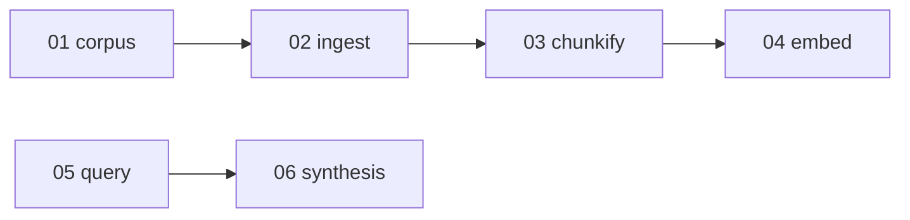

# Knowledge-base design

Write path: corpus → ingest → chunkify → embed. Read path: query → synthesis.

| Doc                                                    | Contract                                                           |
| ------------------------------------------------------ | ------------------------------------------------------------------ |
| [01-corpus.md](./01-corpus.md)                         | Git checkout → markdown files (`slug`, `source_path`, sync at SHA) |
| [02-ingest.md](./02-ingest.md)                         | File → `kb_pages.body` (frontmatter, hash skip)                    |
| [03-chunkify.md](./03-chunkify.md)                     | `body` → parents / children                                        |
| [04-embed.md](./04-embed.md)                           | Children → vectors                                                 |
| [05-query.md](./05-query.md)                           | Question → ranked parents                                          |
| [06-synthesis.md](./06-synthesis.md)                   | Prompt → answer                                                    |
| [appendix-a-data-model.md](./appendix-a-data-model.md) | Tables                                                             |
