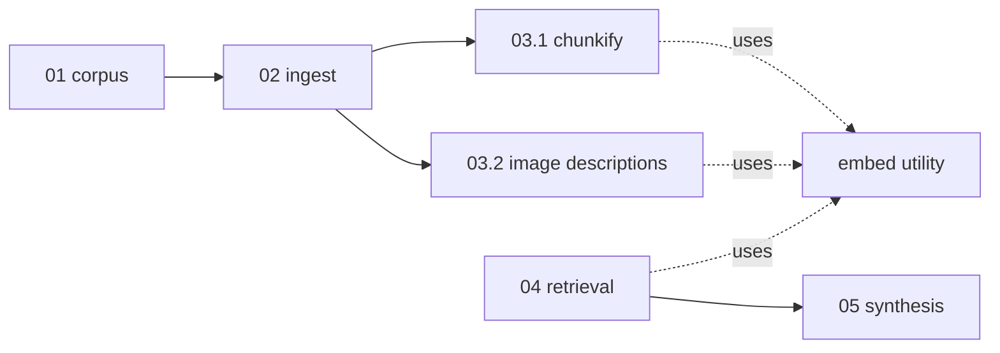

# Knowledge-base design

Write path: corpus → ingest → chunkify / image descriptions.

Read path: retrieval → synthesis.

Vectors are produced and consumed through a shared embed utility, not a flow step.

Every step is gated by a stored hash, so re-running a sync with unchanged input is all skips. Ingest and chunkify are **separate** steps: ingest writes `kb_pages` and the per-image policy; chunkify fills `kb_parents` / `kb_children` only when the page content changed.

| Doc                                                        | Contract                                                                                   |
| ---------------------------------------------------------- | ------------------------------------------------------------------------------------------ |
| [01-corpus.md](./01-corpus.md)                             | Git checkout → markdown files + sibling `*.meta.yaml` (`id`, `source_path`, sync at SHA) |
| [02-ingest.md](./02-ingest.md)                             | Markdown file → `kb_pages` + per-image policy in `kb_image_descriptions` (frontmatter, hash skip) |
| [03.1-chunkify.md](./03.1-chunkify.md)                     | `kb_pages.body` → parents / children                                                       |
| [03.2-image-descriptions.md](./03.2-image-descriptions.md) | `*.meta.yaml` → image captions + description vectors                                       |
| [04-retrieval.md](./04-retrieval.md)                       | Question → ranked parents (+ ranked image descriptions)                                     |
| [05-synthesis.md](./05-synthesis.md)                       | Prompt → answer (image syntax replaced ephemerally)                                         |
| [appendix-a-data-model.md](./appendix-a-data-model.md)     | Tables                                                                                     |

## Freshness keys

| Unit            | Skip when                                                                                              |
| --------------- | ------------------------------------------------------------------------------------------------------ |
| Ingest (page)   | `kb_pages.content_hash` and `kb_pages.meta_hash` both match                                            |
| Chunkify (page) | the page's chunk tree carries `source_page_hash` = `kb_pages.content_hash`                             |
| Caption (image) | `image_content_hash`, `caption_model`, `caption_prompt_version`, and `policy` all match the stored row |
| Any vector      | `embedding_model` = the current `embedding` task model `identifier` (`{providerId}::{modelId}`)         |

The embedding, captioning, and synthesis models are application wiring: [`app_model_task_config`](./appendix-a-data-model.md#model-config-tables) task links, with provider connections in `app_model_provider_config`. No `kb_*` settings table holds a model id.
