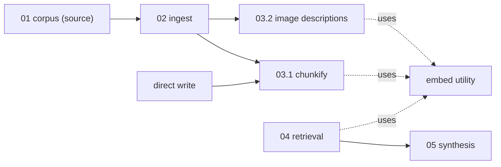

# Knowledge-base design

- Write path
  - read-only knowledge bases flow from `corpus` through `ingest` to `chunkify` / image descriptions
  - writable ones flow from direct write to `chunkify`.

- Read path: retrieval, then synthesis.

Vectors are produced and consumed through a shared embed utility, not a flow step.

The stages are independent: each can run on its own, and its hash gate decides whether it does any work. Wiring them together (an application-level job, a "sync") is optional and application layer.

Content lives in **knowledge bases**: each is either **read-only** (pages ingested from a corpus and written only by the ingest stage) or **writable** (pages updated directly, not by ingest). Every write targets one knowledge base; a search query targets a set of one or more, specified by the request. The backend persists no grouping.

```mermaid
---
theme: neo-dark
---
flowchart LR
  corpus["01 corpus (source)"] --> ingest[02 ingest]
  ingest --> chunkify[03.1 chunkify]
  ingest --> imagedesc[03.2 image descriptions]
  direct[direct write] --> chunkify
  retrieval[04 retrieval] --> synthesis[05 synthesis]
  chunkify -. uses .-> embed[embed utility]
  imagedesc -. uses .-> embed
  retrieval -. uses .-> embed
```

| Doc                                                        | Contract                                                                                                                                 |
| ---------------------------------------------------------- | ---------------------------------------------------------------------------------------------------------------------------------------- |
| [01-corpus.md](./01-corpus.md)                             | Corpus layout: docs root, include/exclude, how a path maps to `source_path` / `id`                                                       |
| [02-ingest.md](./02-ingest.md)                             | Discover files; markdown file becomes a `kb_pages` row (frontmatter, hash skip); reconcile per-image policy into `kb_image_descriptions` |
| [03.1-chunkify.md](./03.1-chunkify.md)                     | Derive parents / children from `kb_pages.body`                                                                                           |
| [03.2-image-descriptions.md](./03.2-image-descriptions.md) | Build image captions + description vectors from `*.meta.yaml`                                                                            |
| [04-retrieval.md](./04-retrieval.md)                       | Question in, ranked parents out (+ ranked image descriptions)                                                                            |
| [05-synthesis.md](./05-synthesis.md)                       | Prompt in, answer out (image descriptions folded into the prompt)                                                                        |
| [appendix-a-data-model.md](./appendix-a-data-model.md)     | Tables                                                                                                                                   |

## Freshness keys

| Unit                       | Skip when                                                                                                                             |
| -------------------------- | ------------------------------------------------------------------------------------------------------------------------------------- |
| Ingest (page)              | `kb_pages.content_hash` and `kb_pages.meta_hash` both match                                                                           |
| Chunkify (page)            | the page's chunk tree carries `source_page_hash` = `kb_pages.content_hash`                                                            |
| Image descriptions (image) | the image's current bytes hash, `caption_model`, and `hardcoded_caption_prompt_hash` match the stored row, and a `description` exists |
| Any vector                 | `embedding_model` = the current embedding model `identifier` (`{providerId}::{modelId}`)                                              |

The embedding, captioning, and synthesis models are application wiring: [`app_model_task_config`](./appendix-a-data-model.md#model-config-tables) task links, with provider connections in `app_model_provider_config`. No `kb_*` settings table holds a model id.
